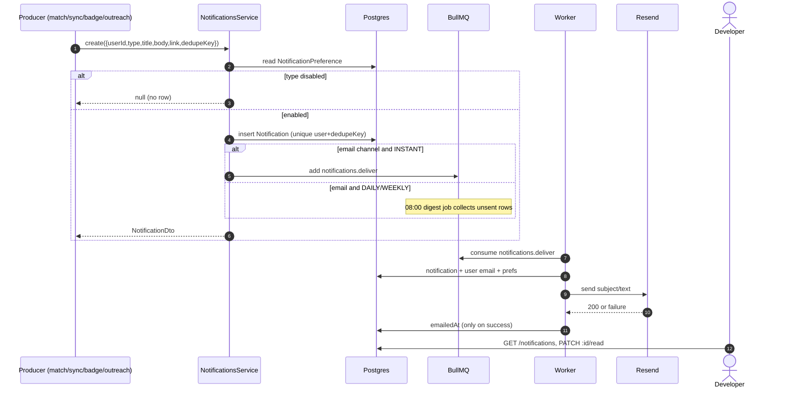

# Sequence — notification delivery

```mermaid
sequenceDiagram
  autonumber
  participant P as Producer (match/sync/badge/outreach)
  participant N as NotificationsService
  participant DB as Postgres
  participant Q as BullMQ
  participant K as Worker
  participant Mail as Resend
  actor D as Developer

  P->>N: create({userId,type,title,body,link,dedupeKey})
  N->>DB: read NotificationPreference
  alt type disabled
    N-->>P: null (no row)
  else enabled
    N->>DB: insert Notification (unique user+dedupeKey)
    alt email channel and INSTANT
      N->>Q: add notifications.deliver
    else email and DAILY/WEEKLY
      Note over Q: 08:00 digest job collects unsent rows
    end
    N-->>P: NotificationDto
  end
  K->>Q: consume notifications.deliver
  K->>DB: notification + user email + prefs
  K->>Mail: send subject/text
  Mail-->>K: 200 or failure
  K->>DB: emailedAt (only on success)
  D->>DB: GET /notifications, PATCH :id/read
```

In-app is the record. A failed email never fails the triggering operation and
is retried up to three times. See FR-13.
