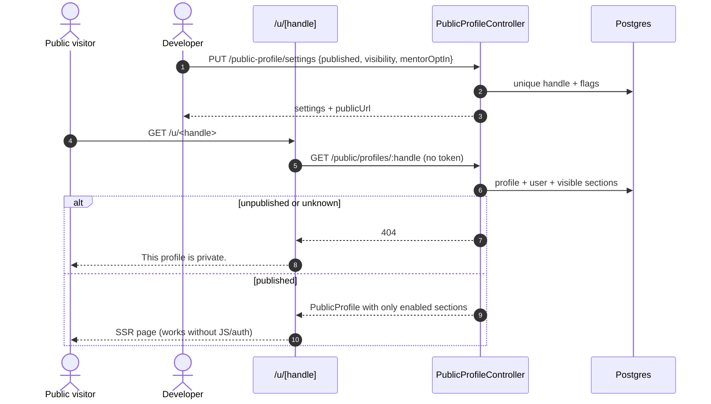

# Sequence — public contribution profile

```mermaid
sequenceDiagram
  autonumber
  actor P as Public visitor
  actor D as Developer
  participant W as /u/[handle]
  participant A as PublicProfileController
  participant DB as Postgres

  D->>A: PUT /public-profile/settings {published, visibility, mentorOptIn}
  A->>DB: unique handle + flags
  A-->>D: settings + publicUrl
  P->>W: GET /u/<handle>
  W->>A: GET /public/profiles/:handle (no token)
  A->>DB: profile + user + visible sections
  alt unpublished or unknown
    A-->>W: 404
    W-->>P: This profile is private.
  else published
    A-->>W: PublicProfile with only enabled sections
    W-->>P: SSR page (works without JS/auth)
  end
```

`githubLogin` is hidden when contributions are hidden; internal user ids are
never returned for non-opted-in profiles. See FR-15.
