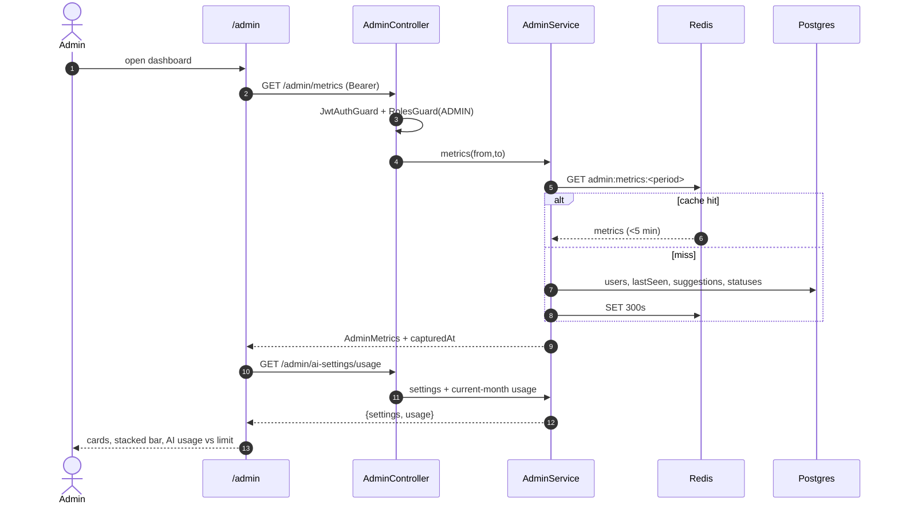

# Sequence — admin metrics and AI usage

```mermaid
sequenceDiagram
  autonumber
  actor A as Admin
  participant W as /admin
  participant API as AdminController
  participant S as AdminService
  participant R as Redis
  participant DB as Postgres

  A->>W: open dashboard
  W->>API: GET /admin/metrics (Bearer)
  API->>API: JwtAuthGuard + RolesGuard(ADMIN)
  API->>S: metrics(from,to)
  S->>R: GET admin:metrics:<period>
  alt cache hit
    R-->>S: metrics (<5 min)
  else miss
    S->>DB: users, lastSeen, suggestions, statuses
    S->>R: SET 300s
  end
  S-->>W: AdminMetrics + capturedAt
  W->>API: GET /admin/ai-settings/usage
  API->>S: settings + current-month usage
  S-->>W: {settings, usage}
  W-->>A: cards, stacked bar, AI usage vs limit
```

Every Admin route is 403 for non-Admins. See FR-19/FR-20.
